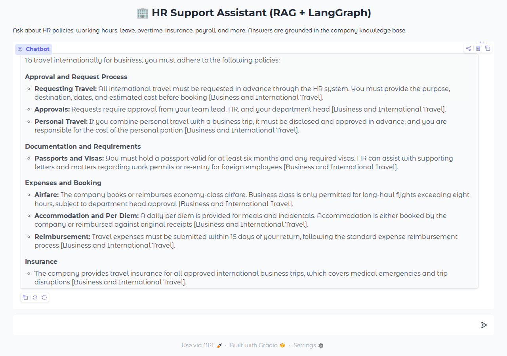
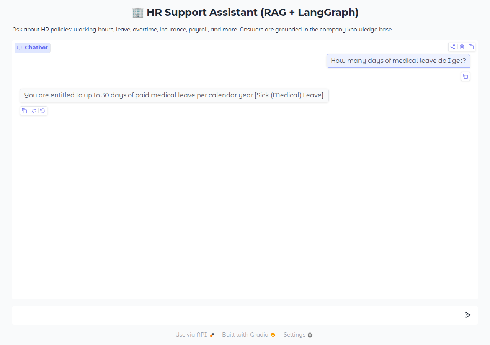
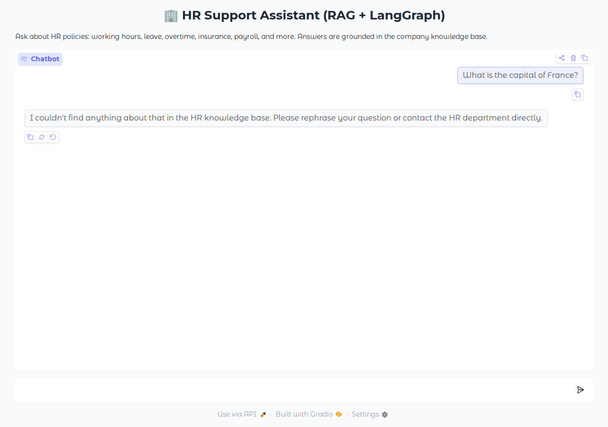
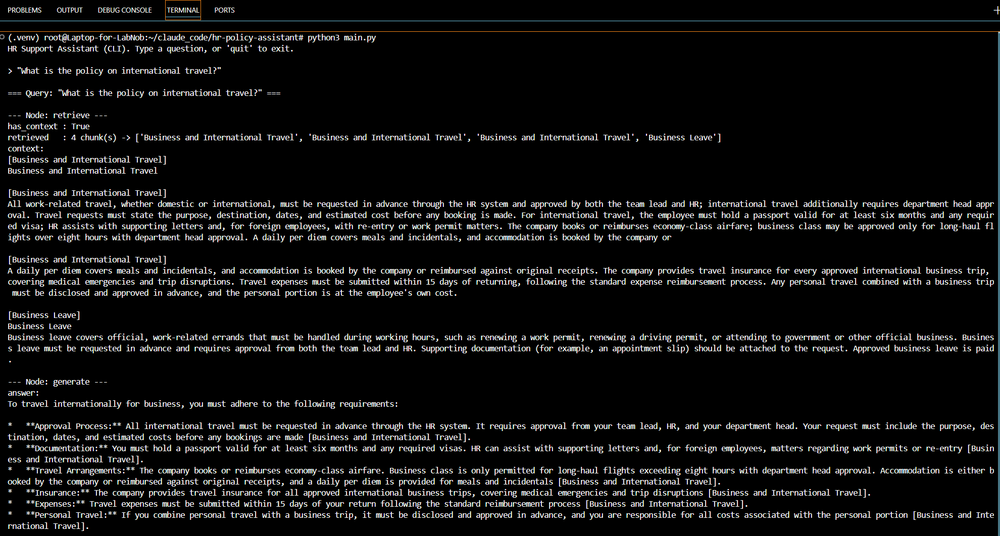
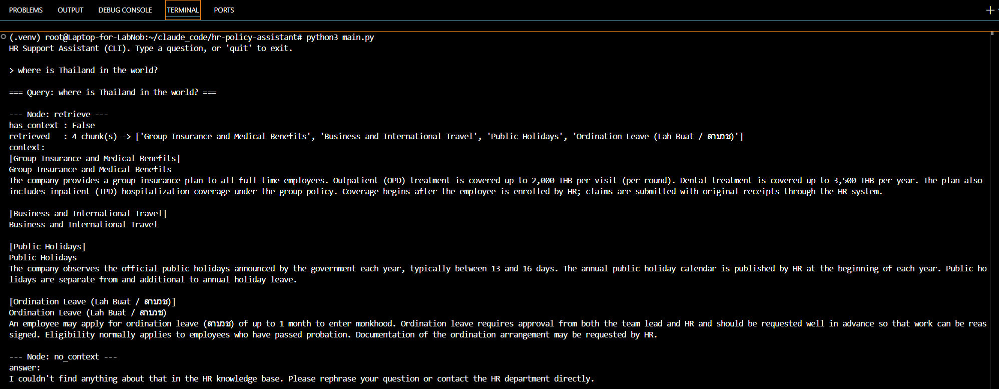
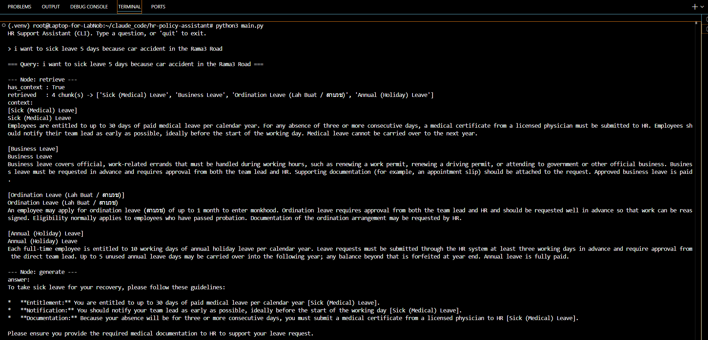

# HR Support Assistant — Multi-Agent RAG (LangChain + LangGraph + Gemini)

A two-agent Retrieval-Augmented Generation system that answers employee
questions about company HR policies. Built with **LangChain** + **LangGraph**,
using **Google Gemini** for both embeddings and answer generation, an
in-memory **LangChain InMemoryVectorStore**, and a **Gradio** UI (deployable to
Hugging Face Spaces).

## Agents / Workflow

```
          ┌─────────────┐   relevant context   ┌──────────────┐
 query ─▶ │  retrieve    │ ───────────────────▶ │  generate    │ ─▶ answer
          │ (Data        │                      │ (Report      │
          │  Retriever)  │ ── nothing found ──┐  │  Generator)  │
          └─────────────┘                    │  └──────────────┘
                                             ▼
                                      ┌──────────────┐
                                      │  no_context  │ ─▶ "not in Knowledge base"
                                      └──────────────┘
```

- **Data Retriever** (`retrieve` node): uses a custom RAG tool to embed the
  knowledge base into an in-memory vector store and return the most relevant
  text chunks. It does **not** answer — it only fetches snippets.
- **Report Generator** (`generate` node): synthesizes the retrieved snippets
  into a clear, non-redundant, cited answer.
- **Conditional edge**: if retrieval finds nothing relevant, the graph routes
  to a `no_context` node instead of letting the model invent a policy.

## Project structure

```
hr_agent/
├── app.py                     # Gradio front end (entry point)
├── config.py                  # loads GOOGLE_API_KEY, defines the Gemini models
├── requirements.txt
├── .env                       # GOOGLE_API_KEY=your_gemini_key  (NOT commit)
├── documents/
│   └── knowledge_base.txt     # the HR policy knowledge base
└── services/
    ├── schemas.py             # LangGraph state definition
    ├── tools.py               # chunking, in-memory index, retrieval, generation
    └── graph.py               # nodes + graph orchestration
```

## Configuration

All model names and retrieval knobs live in `config.py` — the rest of the code
never hard-codes them. Use the `get_llm()` and `get_embeddings()` factories
rather than instantiating models directly.

| Setting          | Default                  | Purpose                                                                 |
| ---------------- | ------------------------ | ----------------------------------------------------------------------- |
| `GOOGLE_API_KEY` | *(required, from env)*   | Gemini API key. Read from `.env` locally or env/Secrets when deployed. Missing → `ValueError` at import. |
| `CHAT_MODEL`     | `gemini-3.1-flash-lite`  | Generation model used by the Report Generator.                          |
| `EMBEDDING_MODEL`| `gemini-embedding-001`   | Embedding model for indexing and search (GA, multilingual).             |
| `TOP_K`          | `4`                      | How many knowledge-base chunks to retrieve per query.                   |
| `MIN_SIMILARITY` | `0.65`                   | Cosine-similarity floor; below this a query routes to the fallback node (see Tuning note). |

## Run locally

```bash
# 1. (optional) create a virtual environment
python -m venv .venv && source .venv/bin/activate   # Windows: .venv\Scripts\activate

# 2. install dependencies
pip install -r requirements.txt

# 3. add your key to .env
echo "GOOGLE_API_KEY=your_actual_key_here" > .env

# 4. run
python app.py
```

Get a free API key at Google AI Studio (aistudio.google.com) → "Get API key".

## Deploy to Hugging Face Spaces

1. Create a new Space → SDK: **Gradio**.
2. Upload all files (or push the repo). `app.py` is the entry point.
3. In **Settings → Secrets**, add `GOOGLE_API_KEY`. Do **not** commit `.env`.
4. The Space builds from `requirements.txt` and launches automatically.

## Example queries

- "What is the policy on international travel?"
- "What are the standard working hours?"
- "How many days of medical leave do I get?"
- "What is the policy on business leave for renewing a driving permit?"
- "How much does the group insurance cover for dental?"
- "When is salary paid each month?"

## Sample output

**Grounded, cited answer:**



**Concise answer from a different section:**



**Anti-hallucination fallback for an out-of-scope question:**



### CLI runs (`python main.py`) — LangGraph node trace

The CLI entry point prints each node's decision (`retrieve` → `generate` /
`no_context`), which makes the graph's routing and the retrieved context
visible per query.

**`retrieve` → `generate`, with the retrieved chunks and cited answer:**



**Out-of-scope question routed to `no_context` (`has_context: False`):**



**Natural-language sick-leave request grounded in `[Sick (Medical) Leave]`:**



## Performance note: cached embeddings

The knowledge base is embedded into the in-memory vector store **once per
process**, not once per request. `get_vectorstore()` in `services/tools.py`
is wrapped in `@lru_cache(maxsize=1)`, so:

- The embedding model is called only the first time a query comes in —
  never again for the lifetime of that process.
- Every question after that, from any user or chat session, reuses the same
  cached vector store; only the short incoming query needs to be embedded,
  not the whole knowledge base. That keeps latency low and avoids paying for
  redundant embedding-API calls.

*(Trade-off: this cache lives only in the process's memory — it isn't
persisted, so it's rebuilt from scratch on every restart, and it doesn't
scale well once the knowledge base gets large. For a bigger corpus, swap
`InMemoryVectorStore` for a real persistent vector database — e.g. Chroma,
FAISS with disk storage, Pinecone, or Weaviate — so embeddings are computed
once and survive restarts/deployments instead of being rebuilt every time.)*

## Swapping the model provider (e.g. OpenAI instead of Gemini)

Because the rest of the codebase only ever calls the `get_llm()` and
`get_embeddings()` factories — it never imports a provider class or hard-codes a
model name — switching providers is a **`config.py`-only** change. Nothing in
`services/` or `app.py` needs to be touched.

To use OpenAI instead of Google Gemini:

1. Install the OpenAI integration:

   ```bash
   pip install langchain-openai       # add it to requirements.txt too
   ```

2. Set `OPENAI_API_KEY` (in `.env` locally, or as a Secret when deployed)
   instead of `GOOGLE_API_KEY`.

3. Point the factories at the OpenAI classes in `config.py`:

   ```python
   import os
   from dotenv import load_dotenv
   from langchain_openai import ChatOpenAI, OpenAIEmbeddings

   load_dotenv()

   OPENAI_API_KEY = os.environ.get("OPENAI_API_KEY")
   if not OPENAI_API_KEY:
       raise ValueError("OPENAI_API_KEY is not set (see .env / Secrets).")

   # --- Model names ---
   CHAT_MODEL = "gpt-4o-mini"                 # any OpenAI chat model
   EMBEDDING_MODEL = "text-embedding-3-small" # any OpenAI embedding model

   # Retrieval settings (unchanged)
   TOP_K = 4
   MIN_SIMILARITY = 0.65

   def get_llm(temperature: float = 0.2) -> ChatOpenAI:
       """Return the chat model used by the Report Generator."""
       return ChatOpenAI(model=CHAT_MODEL, temperature=temperature)

   def get_embeddings() -> OpenAIEmbeddings:
       """Return the embedding model used to index and search the KB."""
       return OpenAIEmbeddings(model=EMBEDDING_MODEL)
   ```

The same pattern applies to any LangChain-supported provider (Anthropic via
`langchain-anthropic`, Ollama, Azure OpenAI, etc.) — swap the imports and the
two factory bodies, keep the interface identical.

> Note: `MIN_SIMILARITY` may need retuning after a provider swap — different
> embedding models produce different similarity scales.

## Tuning note

`config.MIN_SIMILARITY` controls when a query is judged "not in the knowledge
base". It uses cosine similarity (1 = identical, 0 = unrelated) and is set
leniently so real HR questions always pass. After running with a real key,
watch the retrieval similarities and raise it if off-topic questions slip
through. The generation prompt is the primary guard against hallucination.
